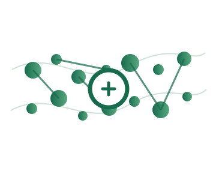

::: {.hero-wrap}
::: {}

Computational biophysics · SDU

From molecular motion to biological mechanism.

We use molecular dynamics simulations and related computational methods to understand membranes, membrane proteins, molecular transport, self-assembly and disease-linked biomolecular mechanisms.

[Explore our research](research.qmd){.btn .btn-success .mt-3}
:::

{.hero-mark}
:::

::: {.section-wide}
## Research

Transport<h3>Mitochondrial & membrane transport</h3>
Mechanisms of transport, proton coupling and regulation in membrane proteins, including mitochondrial carriers and ion pumps.

Membranes<h3>Membrane physics & repair</h3>
How proteins, lipids, curvature, electric fields and chemical modifications reshape biological membranes.

Methods<h3>Simulation & molecular design</h3>
Advanced simulation, enhanced sampling and computational approaches for biomolecular mechanism and design.

## Latest news

::: {#listing}
:::

[All news →](news.qmd)
:::
